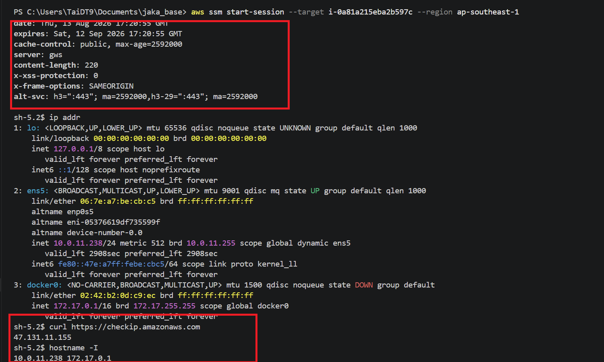
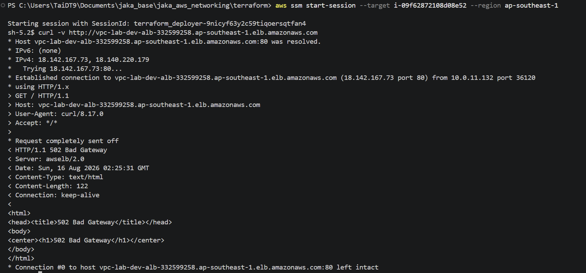
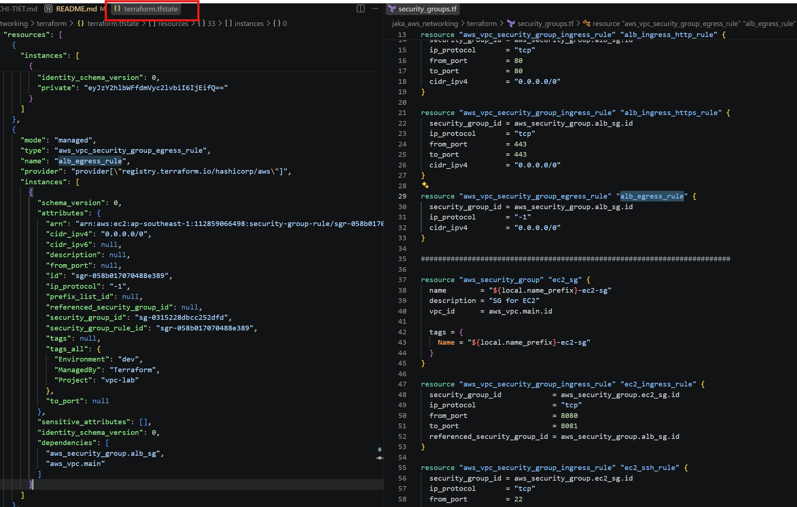
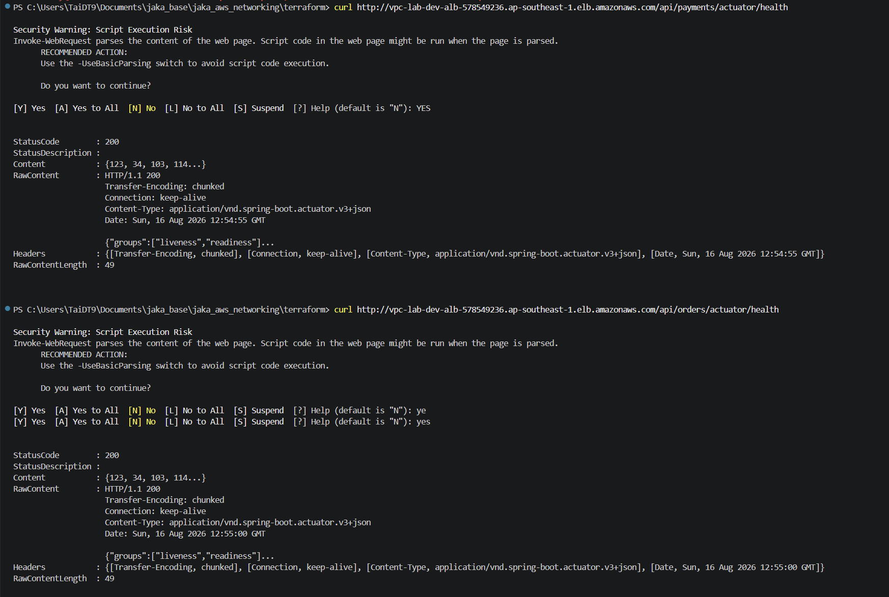
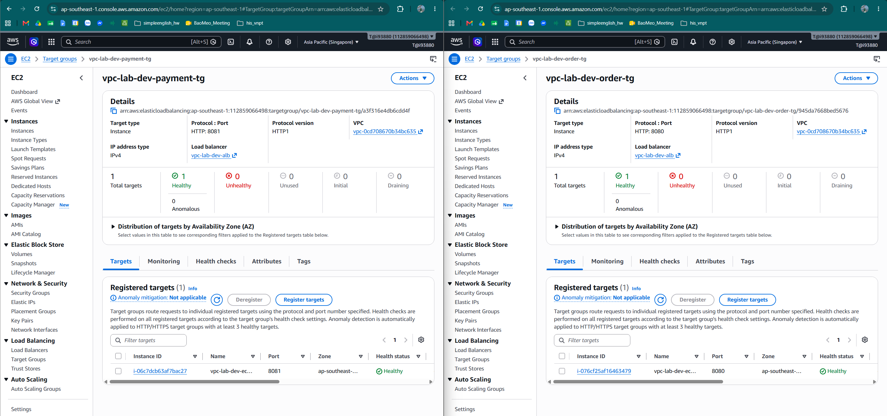

# Terraform AWS Networking — README

Terraform configuration that provisions a two-AZ AWS VPC (public/private subnets, IGW, NAT), security groups, an Application Load Balancer with path-based routing, and two private EC2 instances (order-service, payment-service) reachable only through the ALB. This README covers how to deploy it, the resulting architecture, and proof that networking/routing/security work as intended.

---

## Contents

- [Contents of this folder](#contents-of-this-folder)
- [Prerequisites](#prerequisites)
- [Architecture](#architecture)
  - [VPC & subnets](#vpc--subnets)
  - [Route tables](#route-tables)
  - [Security groups](#security-groups)
  - [Private-instance access](#private-instance-access)
- [Application Load Balancer](#application-load-balancer)
- [Deploy (PowerShell)](#deploy-powershell)
- [Verification & proof](#verification--proof)
- [Destroy / teardown](#destroy--teardown)
- [Git / CI precautions](#git--ci-precautions)
- [Troubleshooting](#troubleshooting)
- [Possible next steps](#possible-next-steps)

---

## Contents of this folder

- `*.tf` — Terraform configuration (VPC, subnets, IGW, NAT, route tables, security groups, ALB, target groups, EC2, SSM instance profile, outputs, variables, provider, versions)
- `terraform.tfvars` — variable values used for local testing (region, CIDRs, AZs, project/environment)
- `pictures_proof/` — screenshots proving connectivity/security/routing behavior (see [Verification & proof](#verification--proof))
- `terraform.tfstate` — (local) Terraform state created after apply. Do **NOT** commit this file to Git.

---

## Prerequisites

- Terraform (recommended >= 1.6)
- AWS CLI (optional but useful for verification; required for SSM Session Manager access)
- AWS credentials with sufficient permissions
- PowerShell on Windows (examples below use PowerShell)

Note: for CI/CD (GitHub Actions) use OIDC role assumption rather than long-lived access keys.

---

## Architecture

### VPC & subnets

Legend: IGW = Internet Gateway, NAT = NAT Gateway, ALB = Application Load Balancer, AZ = Availability Zone

```
AWS Region (ap-southeast-1)
  VPC 10.0.0.0/16   (terraform output vpc_id)
   |
   +-- AZ1 (ap-southeast-1a)
   |     +-- Public Subnet 1  (10.0.1.0/24)  -> route: 0.0.0.0/0 via IGW | hosts: NAT Gateway, ALB node
   |     +-- Private Subnet 1 (10.0.11.0/24) -> route: 0.0.0.0/0 via NAT | hosts: EC2 order-service (:8080)
   |
   +-- AZ2 (ap-southeast-1b)
   |     +-- Public Subnet 2  (10.0.2.0/24)  -> route: 0.0.0.0/0 via IGW | hosts: ALB node
   |     +-- Private Subnet 2 (10.0.12.0/24) -> route: 0.0.0.0/0 via NAT | hosts: EC2 payment-service (:8081)
   |
   +-- Internet Gateway (IGW) -- attached to the VPC, used by both public subnets
   +-- NAT Gateway -- deployed in Public Subnet 1 (AZ1), used by both private subnets
```

- EC2 instances in private subnets have no public IP and are therefore **not** directly reachable from the Internet.
- Private EC2 instances reach the Internet outbound through the NAT Gateway (source: [nat.tf](nat.tf)).

### Route tables

See [route_table.tf](route_table.tf):

| Route table | Rule | Associated subnets |
|---|---|---|
| `route_table_public` | `0.0.0.0/0 -> Internet Gateway` | Public Subnet 1, Public Subnet 2 |
| `route_table_private` | `0.0.0.0/0 -> NAT Gateway` (NAT lives in Public Subnet 1 / AZ1) | Private Subnet 1, Private Subnet 2 |

### Security groups

See [security_groups.tf](security_groups.tf):

| Security group | Inbound | Notes |
|---|---|---|
| `alb-sg` | 80/443 from `0.0.0.0/0` | only internet-facing edge; outbound all |
| `ec2-sg` | 8080-8081 **only from `alb-sg`**; 22 from `var.ssh_allowed_cidr` | never reachable from the internet directly; outbound all |
| `rds-sg` | 5432 (Postgres) only from `ec2-sg` | |
| `redis-sg` | 6379 (Redis) only from `ec2-sg` | |

> ⚠️ `ssh_allowed_cidr` defaults to `0.0.0.0/0` in [variables.tf](variables.tf) for lab convenience. Restrict it to your admin IP/CIDR in `terraform.tfvars` to follow least-privilege — the EC2 instances have no public IP today so this rule isn't internet-reachable, but the SG rule itself should still be scoped down.

### Private-instance access

There is **no bastion host** in this environment. EC2 instances have no public IP (`associate_public_ip_address = false`) and are administered via **AWS Systems Manager (SSM) Session Manager** (see `ssm_instance_profile.tf`), which avoids opening SSH to the instances at all.

```powershell
# From your workstation — no public IP or open SSH port required on the instance
aws ssm start-session --target <instance-id>
```

---

## Application Load Balancer

- ALB name: `vpc-lab-dev-alb`, internet-facing, deployed across both public subnets (AZ1 + AZ2) for multi-AZ availability.
- DNS name: printed by `terraform output alb_dns_name` after apply. Example from a prior run: `vpc-lab-dev-alb-546044212.ap-southeast-1.elb.amazonaws.com`.
- Listener: HTTP, port 80.

Path-based routing rules (see [alb.tf](alb.tf)):

| Priority | Path pattern | Target group | Forwards to |
|---|---|---|---|
| 100 | `/api/orders`, `/api/orders/*` | `order-tg` (port 8080) | EC2 order-service instance |
| 200 | `/api/payments`, `/api/payments/*` | `payment-tg` (port 8081) | EC2 payment-service instance |
| default | any other path | `order-tg` (port 8080) | listener's default action |

Target group health checks (see [target_groups.tf](target_groups.tf)):

| Target group | Health check path | Port |
|---|---|---|
| `order-tg` | `/api/orders/actuator/health` | traffic-port (8080) |
| `payment-tg` | `/api/payments/actuator/health` | traffic-port (8081) |

> Health check paths include each service's context path (`/api/orders`, `/api/payments`) instead of a bare `/actuator/health`, matching how the two Spring Boot services are actually exposed behind the ALB.

Verify routing manually:

```bash
curl -i http://<ALB_DNS_NAME>/api/orders
curl -i http://<ALB_DNS_NAME>/api/payments
```

---

## Deploy (PowerShell)

1. Change into this folder:

```powershell
Set-Location "C:\Users\TaiDT9\Documents\jaka_base\jaka_aws_networking\terraform"
```

2. Set AWS credentials for the current session (temporary):

```powershell
$env:AWS_ACCESS_KEY_ID = "<YOUR_ACCESS_KEY>"
$env:AWS_SECRET_ACCESS_KEY = "<YOUR_SECRET_KEY>"
$env:AWS_SESSION_TOKEN = "<YOUR_SESSION_TOKEN>"  # if using temporary creds
$env:AWS_REGION = "ap-southeast-1"
```

3. Initialize Terraform:

```powershell
terraform init
```

4. Validate and format:

```powershell
terraform fmt
terraform validate
```

5. Preview and apply:

```powershell
terraform plan -var-file="terraform.tfvars"
terraform apply -var-file="terraform.tfvars"
# or to skip interactive approval:
# terraform apply -var-file="terraform.tfvars" -auto-approve
```

6. Inspect outputs:

```powershell
terraform output              # list all outputs
terraform output vpc_id
terraform output alb_dns_name
terraform output ec2_order_private_ip
terraform output ec2_payment_private_ip
```

---

## Verification & proof

### VPC / NAT — private EC2 reaches the Internet

Steps to reproduce and preserve proof that a private EC2 can reach the Internet via the NAT gateway:

1. Capture Terraform outputs after apply:

```powershell
terraform output > deploy_outputs.txt
```

2. Example outputs from a previous successful apply (kept here as reference):

- vpc_id: `vpc-0dec48674aa8d4de1`
- alb_dns_name: `vpc-lab-dev-alb-546044212.ap-southeast-1.elb.amazonaws.com`
- ec2_private_ip: `10.0.11.39`
- instance id: `i-08e5a95374996fd73`

(These values are from a prior apply recorded in the local state file — keep them as evidence in your run artifacts.)

3. Connect to the private EC2 via SSM Session Manager (no bastion needed):

```powershell
aws ssm start-session --target i-08e5a95374996fd73
```

4. Inside the private EC2, test outbound connectivity (ICMP may be blocked on some OS images — prefer a TCP/HTTP test):

```bash
nslookup google.com
curl -I https://www.google.com
# On Windows (PowerShell): Test-NetConnection -ComputerName google.com -Port 443
```

Expected result: `curl -I https://www.google.com` returns HTTP 200/302 headers. Save the terminal output as proof:

```powershell
curl -I https://www.google.com > nat_proof.txt
```

**Proof:** 

### Security groups — reachability matrix

| Claim | Proof |
|---|---|
| EC2 can reach the ALB (port 8080 open, `ec2-sg` allows egress / `alb-sg` reachable) |  |
| ALB can reach the Internet (port 80 open outbound) |  |
| EC2 is **not** reachable from the Internet directly | No public IP is assigned (`associate_public_ip_address = false` in [ec2.tf](ec2.tf)), so there is no route from the internet to the instance regardless of SG rules. |

### ALB — routing & health

| Claim | Proof |
|---|---|
| Applications inside EC2 are reachable through the ALB DNS |  |
| Target groups are healthy |  |

---

## Destroy / teardown

From the same folder, after confirming you're using the correct AWS credentials:

```powershell
terraform destroy -var-file="terraform.tfvars" -auto-approve
```

After a successful destroy, you may remove local state files (only once you've confirmed resources are deleted):

```powershell
Remove-Item terraform.tfstate
Remove-Item terraform.tfstate.backup
Remove-Item -Recurse .terraform
```

---

## Git / CI precautions

- Add a `.gitignore`:

```
.terraform/
*.tfstate
*.tfstate.*
crash.log
override.tf
override.tf.json
*.auto.tfvars
```

- Do NOT commit AWS credentials or local state files.
- Configure a remote backend (S3 + DynamoDB) for production state locking before using CI to run apply.
- Use OIDC/role assumption in GitHub Actions; avoid storing keys in Actions secrets if possible.

---

## Troubleshooting

- Region: check `terraform.tfvars` — the default region in this workspace is `ap-southeast-1`.
- If you do not see resources in the AWS console, confirm the console region matches the Terraform region.
- If `terraform plan` returns authentication errors (STS `GetCallerIdentity` failures), verify AWS credentials or role permissions.
- Consider configuring a remote state backend (S3 + DynamoDB) before enabling CI automated `apply`.

---

## Possible next steps

- Add a minimal `bastion` Terraform resource (optional — SSM Session Manager already covers private-instance access without one) and wire its SG.
- Add a GitHub Actions workflow that runs `terraform init/plan` on PRs and `terraform apply` on the protected branch with OIDC role assumption.
- Tighten `ssh_allowed_cidr` to a specific admin IP/CIDR instead of `0.0.0.0/0`.
- Add IAM roles/policies for the EC2 instances (CloudWatch logs, S3, Secrets Manager) per the Week 2 plan.
abling CI automated `apply`.

---

If you want, I can also:
- add a minimal `bastion` Terraform resource to this repo and wire the SGs
- create a basic GitHub Actions workflow that runs `terraform init/plan` on PRs and `terraform apply` on protected branch with OIDC role assumption

abling CI automated `apply`.

---

If you want, I can also:
- add a minimal `bastion` Terraform resource to this repo and wire the SGs
- create a basic GitHub Actions workflow that runs `terraform init/plan` on PRs and `terraform apply` on protected branch with OIDC role assumption

abling CI automated `apply`.

---

If you want, I can also:
- add a minimal `bastion` Terraform resource to this repo and wire the SGs
- create a basic GitHub Actions workflow that runs `terraform init/plan` on PRs and `terraform apply` on protected branch with OIDC role assumption

